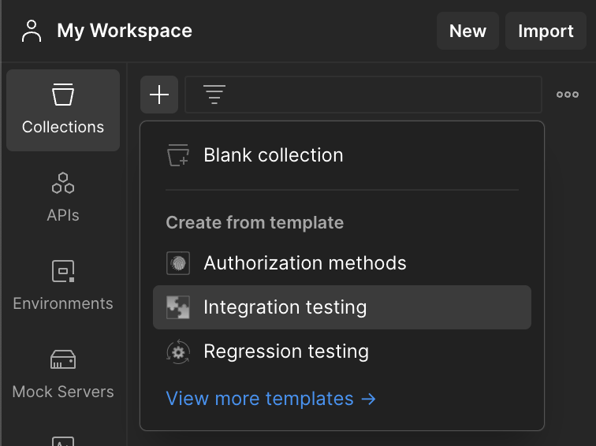
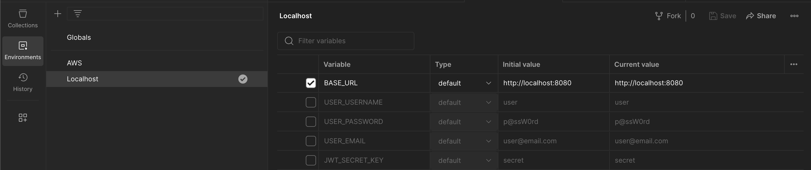
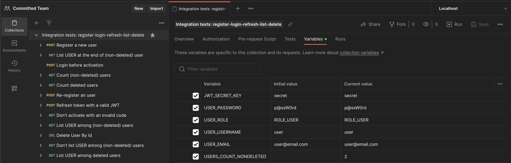
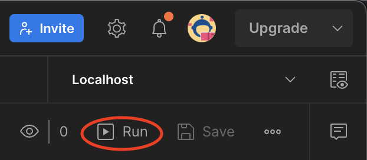
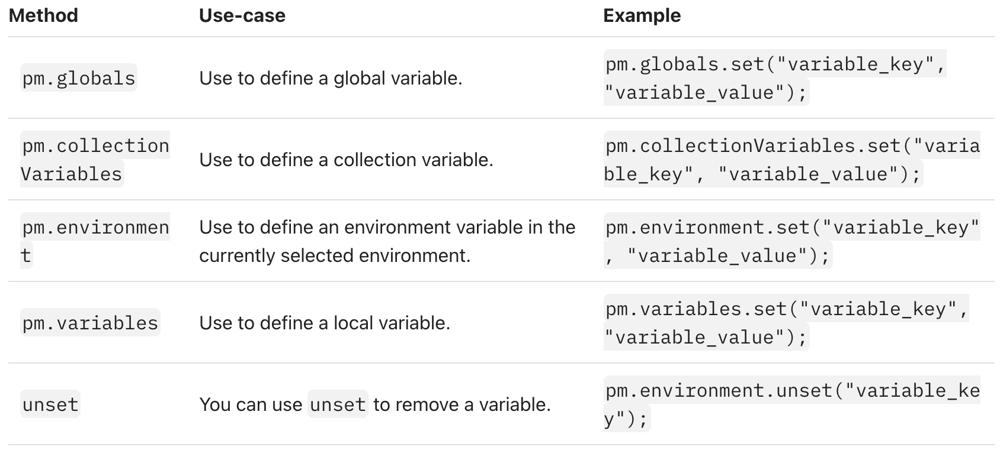

# Postman tests

---

### Add integration tests

1. Add a collection template


1. Set environment (and global) envs


1. Set collection envs


1. Run Tests


---

## Notes

---

##### get (from) a *response body*

`responseBody` // as a string(?)

`pm.response.json()` // as a POJO

---

## Snippets

---

```js
pm.response.json()[myIndex] // get element by index

pm.response.json().myField // get value of field

pm.response.json().find(/* my_lambda */) // get one element

pm.response.json().filter(/* my_lambda */) // get more elements

pm.response.json().filter(/* my_lambda */)[myIndex] // get one elements
```

---

##### lambda and inline functions

```js
// lambda method
(() => /* lambda body*/ ) 

// lambda predicate
arg => arg === 'compare_to' 

// inline function
function() {
// method body
return myValue // if applicable
}

// inline predicate
function(arg) {
    return arg === 'compare_to';  
}
```

---

##### get envs (outside javascript)

`{{my_env_key}}`

---

##### set / get / unset envs inside *javascript*

```js
pm.collectionVariables.set("my_env_key", myValue);

pm.variables.set("my_env_key", JSON.stringify(myPojo));

pm.environment.unset("my_env_key");

let myVariable = pm.globals.get("my_env_key");

let myPojo = JSON.parse(pm.collectionVariables.get("my_env_key"));
```

> postman stores variables as strings, if you store objects or arrays:
> + `JSON.stringify()` them before storing
> + `JSON.parse()` them when you retrieve



+ [docs on using variables](https://learning.postman.com/docs/sending-requests/variables/)
+ [post on chaining requests](https://blog.postman.com/how-to-make-money-using-postman-chaining-requests/)

---

##### test methods

```js
pm.test("my_method_name", function () {
    // expect (assert) statement(s)
});
```

---

##### expect (assert) statements

```js
pm.response.to.have.status(200)

pm.response.to.have.header("my_key")
pm.response.to.be.header("my_key","my_value")

pm.expect(pm.response.json().myKey).to.match(/regex/) // note the / around the regex /
pm.expect(pm.response.json().myKey).to.eql(myValue)
// responseBody.myKey doesn't work!
pm.expect(responseBody).to.not.contain("\"exact_match\"") // including " "

pm.expect(nullValue).to.be.null;
pm.expect(notNullValue).not.null;
pm.expect(nullValue).is.null;
pm.expect(notYetDefinedVariable).to.be.undefined
pm.expect(notNullValue).not.eq(null);
pm.expect(notYetDefinedVariable).is.undefined;
// ...
```
+ [docs on writing test scripts](https://learning.postman.com/docs/writing-scripts/test-scripts/)

+ [examples of test scripts](https://learning.postman.com/docs/writing-scripts/script-references/test-examples/)

---

## Examples

---

##### filter / find inside response JSON body

```js
let user = pm.response.json().find(user => user.id === userId);

let user = pm.response.json().filter(user => user.id === userId)[0]; // note the [0]!
```

---

##### custom URL with envs

`https://{{base_url}}/get?customer_id={{cust_id}}`

where `base_url` is set to `http://localhost:8080` and`cust_id` set to `1`


---

##### *responseBody* **not** containgn a *string*

```js
pm.test("USER's username is not among users", function() {
    let userUsername = pm.collectionVariables.get("USER_USERNAME");
    pm.expect(responseBody).to.not.contain("\"" + userUsername + "\"");
});
```

---

##### response *status code*

```js
pm.test("Status code is 200", function () {
    pm.response.to.have.status(200);
});
```

---

##### response *header*

```js
pm.test("Content-Type is present", function () {
    pm.response.to.have.header("Content-Type")
});
pm.test("Content-Type is application/json", function () {
    pm.response.to.be.header("Content-Type","application/json")
});
```

---

##### Validate JWT with simple *regex*

```js
pm.test("Access token has the correct header part", function() {
    pm.expect(pm.response.json().access_token).to.match(/^eyJhbGciOiJIUzI1NiIsInR5cCI6IkpXVCJ9\..+/)
}); // note the / around the regex /
```

---

##### filter / find specific user inside a list

```js
pm.test("User found by username", function() {
    let userUsername = pm.collectionVariables.get("USER_USERNAME");
    let user = pm.response.json().find(function(user) {
        return user.username === userUsername;
    });
    pm.expect(user).not.eq(null);
});

pm.test("User found by id", function() {   
    let userUsername = pm.collectionVariables.get("USER_USERNAME");
    let userId = pm.collectionVariables.get("USER_ID");
    let user = pm.response.json().filter(user => user.id === userId)[0]; // note the [0]!
    pm.expect(user.username).to.eql(userUsername);
});

pm.test("User not found by username", function() {
    let userUsername = pm.collectionVariables.get("USER_USERNAME");
    let user = pm.response.json().find(function(user) {
        return user.username === userUsername;  
    });
    pm.expect(user).to.be.undefined;
});
```